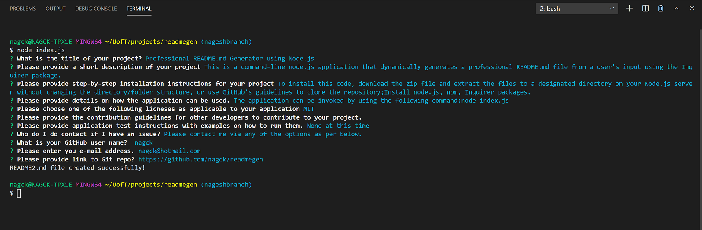

# Node.js: Professional README Generator

## Description
This is a command-line node.js application that dynamically generates a professional README.md file from a user's input using the Inquirer package. 

In this repository ("README Generator"), I have created a command-line application (as part of my assignment for UofT SCS Coding Boot Camp Course) that dynamically generates a professional README.md file from a user's input using the [Inquirer package](https://www.npmjs.com/package/inquirer).

Technologies Used: JavaScript, Node.js, npm, Inquirer

## Installation

- To install this code, download the zip file and extract the files to a designated directory on your Node.js server without changing the directory/folder structure, or use GitHub's guidelines to clone the repository. 
- Install node.js, npm, Inquirer packages 

## Usage 

The application can be invoked by using the following command:

```bash
node index.js
```
## Screenshot of the application:


## Link to walkthrough video demonstrating the functionality of the application:
https://github.com/nagck/readmegen

## A sample README file for a project repository generated using this application
https://github.com/nagck/readmegen/README2.md

## Credits

- The application has been developed using JavaScript, Node.js, npm, Inquirer. 

- Sincere thanks to my course instructors Ed (Edward Apostol), Anas (Anas Qazi) and Herman (German Arcila) for teaching and helping me in acquring HTML/CSS/JavaScript/Node.js skills. And of course thanks to my fellow students for sharing valuable tips and tricks on Slack study groups.

- Here are some websites that I referred to improve the code:
* https://www.w3schools.com/js/default.asp
* https://developer.mozilla.org/en-US/docs/Web/JavaScript
* https://www.w3schools.com/nodejs/
* https://www.npmjs.com/
* https://www.npmjs.com/package/inquirer


## License
Licensed under the [MIT](https://choosealicense.com/licenses/mit/) license.<br>
<br />
## Feedback
Feedback is always appreciated. If you are interested in fixing any issues and contributing directly to the code base, please provide at  https://github.com/nagck/readmegen/pulls


---

